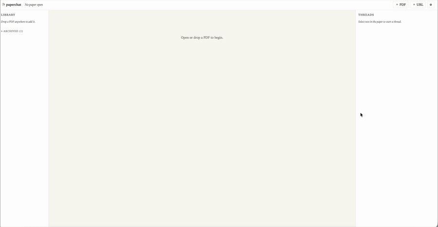

# paperchat

A local-first PDF reader where you select a passage and start a threaded AI
discussion anchored to it. Inspired by [Fermat's Library][fermat] — same
"select text, leave a margin annotation" flow, but the commenters are LLMs you
invite with `@mentions` (`@claude`, `@grok`, `@gpt`, `@code`).

[fermat]: https://fermatslibrary.com/



*(4× speed)*

- **Multiple models per thread** — invite different agents into the same
  conversation by mentioning them.
- **Tools** — the agents can search inside the paper, fetch arXiv metadata,
  read web pages, run Python in a sandbox, scroll the viewer, and highlight
  passages for you.
- **`@code`** — a special mention that routes through the
  [Claude Agent SDK][sdk] with full Read/Edit/Bash/Grep/WebFetch tools, in a
  per-thread sandbox directory.
- **Local-first** — PDFs and threads live in your browser's IndexedDB. No
  server-side database. The dev server only proxies API calls and serves
  static files.

[sdk]: https://www.npmjs.com/package/@anthropic-ai/claude-agent-sdk

## Quick start

One-line install (clones to `~/paperchat`, installs deps, optionally
launches the dev server):

```sh
curl -fsSL https://raw.githubusercontent.com/eitanporat/paperchat/main/install.sh | bash
```

Or manually:

```sh
git clone https://github.com/eitanporat/paperchat.git
cd paperchat
npm install
npm run dev
```

Open <http://localhost:5173>, click ⚙ to paste your OpenRouter key (or
put it in `.env` — see Configuration), drop a PDF, select a passage,
click `@claude`.

On macOS, `@code` works automatically — the dev server reads the API
key from your local `claude` CLI's keychain entry. No extra setup.

During install, the script auto-detects an existing OpenRouter key
from these sources (and asks for your permission before using it):

- `$OPENROUTER_API_KEY` environment variable
- [`opencode`](https://github.com/sst/opencode)'s auth store at
  `~/.local/share/opencode/auth.json` (the `openrouter.key` field)

If a key is found, the installer prints which file it came from and
asks `Use it for paperchat? [Y/n]` — your choice. Decline (or have no
key on disk yet) and it offers to open
<https://openrouter.ai/keys> so you can grab one. Either path writes
the key into `.env.local` (mode 600).

Installer environment overrides:

| Variable | Purpose |
|---|---|
| `PAPERCHAT_DIR` | Install destination (default `~/paperchat`). |
| `PAPERCHAT_REPO` | Use a fork instead of the canonical repo. |
| `PAPERCHAT_BRANCH` | Check out a different branch (default `main`). |
| `PAPERCHAT_NO_START=1` | Skip auto-launching the dev server. |
| `PORT` | Dev server port (default `5173`). |

## Configuration

Credentials come from (in order of precedence):

1. **macOS Keychain** — `dev-server.mjs` reads the local `claude` CLI's API
   key from the `Claude Code` keychain entry. Used as the default for `@code`
   when no other Anthropic key is set. Linux/Windows: skipped.
2. **`.env` and `.env.local`** — both gitignored; `.env.local` overrides `.env`.
3. **In-app ⚙ Settings** — for OpenRouter only; stored in `localStorage`.

| Variable | Powers | Required |
|---|---|---|
| `OPENROUTER_API_KEY` | `@claude` / `@grok` / `@gpt` | Yes, unless you set it via ⚙ Settings. Get one at <https://openrouter.ai/keys>. |
| `ANTHROPIC_API_KEY`  | `@code` (Claude Agent SDK)   | Optional on macOS (keychain fallback covers it); required on Linux/Windows if you want `@code`. Get one at <https://console.anthropic.com/>. |
| `PORT` | dev server port | Optional (default `5173`). |

Default models per mention (override in ⚙ settings):

| Mention | Default model | Provider |
|---|---|---|
| `@claude` | `anthropic/claude-opus-4.7` | OpenRouter |
| `@grok`   | `x-ai/grok-4.3`             | OpenRouter |
| `@gpt`    | `openai/gpt-5.5`            | OpenRouter |
| `@code`   | (Claude Agent SDK)          | Local Anthropic API |

## Architecture

Static client + a tiny zero-dependency Node dev server.

```
┌──────────────────────────────────────────────────────────────┐
│ Browser (index.html + app.js + ai.js + pdf.js)               │
│  • PDF.js renders pages with text + link layers              │
│  • IndexedDB stores papers (Blob + extracted text), threads, │
│    messages, segments                                        │
│  • Pyodide loads on-demand for run_python                    │
│  • KaTeX + highlight.js render math + code in answers        │
└────────────────────────┬─────────────────────────────────────┘
                         │ HTTPS / SSE
                         ▼
┌──────────────────────────────────────────────────────────────┐
│ dev-server.mjs                                               │
│  • /env.js          — exposes whitelisted env vars           │
│  • /api/fetch       — CORS-bypass proxy for fetch_url        │
│  • /api/claude_code — SSE bridge to @anthropic-ai/           │
│                       claude-agent-sdk                       │
│  • static files                                              │
└────────────────────────┬─────────────────────────────────────┘
                         │
                ┌────────┴────────┐
                ▼                 ▼
       OpenRouter API     Anthropic API
       (@claude/@grok/   (@code mention)
        @gpt mentions)
```

### Tools available to agents

OpenRouter mentions (`@claude`, `@grok`, `@gpt`):

- `get_page_text(page)` — full text of a page in the open paper.
- `find_in_paper(query, max_results?)` — substring search across the open paper.
- `arxiv_lookup(id)` — official arXiv API (Atom XML).
- `fetch_url(url)` — proxied HTTP(S) fetch with HTML stripping.
- `scroll_to_page(page)` — controls the user's viewer.
- `highlight_passage(page, quote)` — temporarily highlight a passage.
- `run_python(code)` — Pyodide sandbox in the browser. numpy/scipy/sympy/etc.
  auto-install. Persistent globals across calls. No network.
- Built-in web search (OpenRouter `web` plugin, implicit).

`@code` (Claude Agent SDK):

- All Claude Code tools — `Read`, `Edit`, `Write`, `Bash`, `Grep`, `Glob`,
  `WebFetch`, `WebSearch`. Working dir is `cc-workdir/<paperId>-<threadId>/`.
- The custom paper-aware tools above are **not** available on this path; the
  agent uses the paper text in its system prompt and `Bash`/`Read` for
  in-sandbox file work.

## Security caveats

- The dev server is for **localhost only**. Do not expose it on a public
  interface.
- `@code` runs with `permissionMode: 'bypassPermissions'`. The agent has full
  filesystem and shell access inside its working directory. The
  `cc-workdir/` sandbox directory is gitignored, but the agent can read
  files outside it via absolute paths if you provide them. Treat as
  semi-trusted.
- `/api/fetch` blocks loopback and private-network hosts to prevent SSRF.

## Project layout

```
paperchat/
├── index.html        # shell + dialog templates
├── app.js            # main client: library, viewer, threads, settings
├── ai.js             # OpenRouter streaming + tool loop + @code SSE consumer
├── pdf.js            # PDF.js wrapper: render, text extraction, selection
├── db.js             # IndexedDB layer (papers, threads, messages)
├── style.css
├── dev-server.mjs    # zero-dep static + /env.js + /api/* proxies
├── .env.example
├── .gitignore
├── LICENSE
├── package.json
└── README.md
```

## License

MIT — see [LICENSE](LICENSE).
